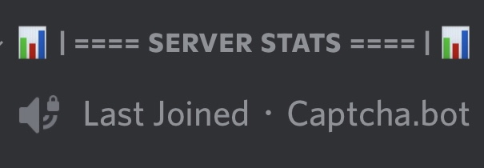

# VERSION 1.0

## ABOUT
This discord bot is designed to help users by creating a voice channel wich always displays the last joined user of a discord server in a vc. It can only run on replit. You can run it [here](https://replit.com/@TopClips/LastJoined-2?v=1)!

## SETUP
Full tutorial on my YouTube Channel! [You can veiw it here](https://youtu.be/43B4TybHjBo)!

1 - Create A VC. You can call it anything then copy the ID of the VC an paste it into index.js where it says "Your Vc Id"

2 - Create a secret and call it "token" then paste your token into it

3 - Turn on all of the Provaledged Gateway Intents  on the discord developer portal

4 - Invite the bot! Make sure you give it Admin Perms

5 - Run The Discord Bot

## 24/7 HOSTING
Copy the link of the webpage and paste it into Uptime Robot to keep the bot running 24/7

## Liscence
This Discord Bot Is Distributed and Coded By TopClips#3240 and can be used by anyone. You Are Not Allowed To Change The Discord Bots Status, I claim the right to taking any bots that break this rule offline. By Forking this you agree to this.  

## HELP
[SUPPORT SERVER](https://discord.gg/PgKGAPdJ2J)

[FORK ME ON REPLIT](https://replit.com/@TopClips/LastJoined-2?v=1)
